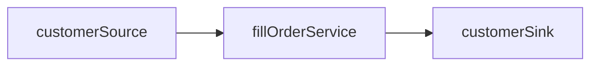

# CoffeeShop

A discrete-event simulation of a coffee shop, built with AnyLogic PLE 8.9.8. The time unit is the **minute**.

## Model Overview

The shop is open from 6:00 am to 2:00 pm (360–840 minutes from midnight). Customers arrive according to an exponential distribution. A worker fills each order according to a triangular distribution; customers queue while the worker is busy.

Customers leave reviews based on their wait time (queue wait + service time). Positive reviews attract more customers; negative reviews reduce arrivals. This feedback loop can be toggled off for baseline experiments.

At midnight each day, the model evaluates average wait time and worker utilization. If wait times are too high, a worker is hired. If utilization is too low, a worker is fired. Worker efficiency degrades as headcount grows due to shared equipment contention.

## Process Flow

## Parameters

| Name                                       | Type     | Default                 | Description                                                                          |
| :----------------------------------------- | :------- | :---------------------- | :----------------------------------------------------------------------------------- |
| `baseTimeBetweenArrivals`                  | double   | 20.0                    | Mean minutes between customer arrivals                                               |
| `dailyOpenTime`                            | double   | 360 (6:00 am)           | Minutes from midnight when the shop opens                                            |
| `dailyCloseTime`                           | double   | 840 (2:00 pm)           | Minutes from midnight when the shop closes                                           |
| `minTimeToFillOrder`                       | double   | 2.0                     | Minimum minutes to fill an order (triangular distribution lower bound)               |
| `modeTimeToFillOrder`                      | double   | 5.0                     | Most likely minutes to fill an order (triangular distribution mode)                  |
| `maxTimeToFillOrder`                       | double   | 8.0                     | Maximum minutes to fill an order (triangular distribution upper bound)               |
| `waitTimeSentimentThreshold`               | double   | 5.0                     | Wait times below this (minutes) produce a positive experience; at or above, negative |
| `probabilityReviewGivenPositiveExperience` | double   | 0.20                    | Probability a satisfied customer leaves a review                                     |
| `probabilityReviewGivenNegativeExperience` | double   | 0.30                    | Probability a dissatisfied customer leaves a review                                  |
| `reviewsAffectArrivalRate`                 | boolean  | true                    | Enables the customer feedback loop; when false, arrival rate is constant             |
| `arrivalMultiplierMin`                     | double   | 0.5                     | Arrival rate multiplier when all reviews are negative                                |
| `arrivalMultiplierMax`                     | double   | 1.5                     | Arrival rate multiplier when all reviews are positive                                |
| `hireWorkers`                              | boolean  | true                    | Enables daily worker hiring and firing; when false, worker count stays at 1          |
| `hireWaitTimeThreshold`                    | double   | 8.0                     | Daily average wait time (minutes) that triggers hiring a worker                      |
| `fireUtilizationThreshold`                 | double   | 0.30                    | Daily worker utilization below which a worker is fired                               |
| `workerEfficiencyTable`                    | double[] | 1.0, 1.0, 0.9, 0.7, 0.5 | Efficiency multiplier indexed by worker count                                        |

**Notes**

- `workerEfficiencyTable`: Array length sets the maximum number of workers. An array length of 5 means 5 maximum workers. Setting all values to 1.0 would make all workers 100% efficient.

## Design Decisions

**Triangular distribution for service time.** Service time uses a triangular distribution rather than exponential. This is safe because each order is processed atomically by the Service block — the worker starts and finishes without interruption. There are no handoffs, pauses, or restarts, so the memoryless property of the exponential distribution is not needed. The triangular distribution gives bounded, intuitive parameters (min/mode/max) that stakeholders can reason about directly.

If the model were extended so that service could be interrupted and resumed (e.g., a worker takes a break mid-order), the triangular distribution would be problematic: the remaining service time would depend on how much time had already elapsed, requiring explicit state tracking. In that case, the exponential distribution's memoryless property would simplify the model — the remaining time always follows the same distribution regardless of elapsed time.
