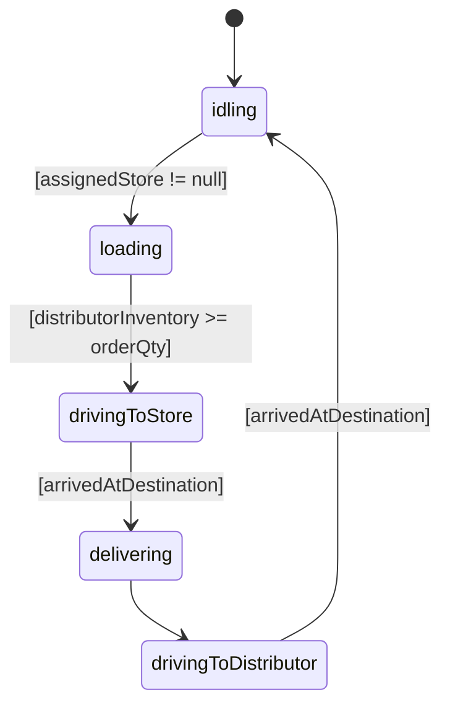

# SupplyChain

A hybrid System Dynamics + Agent-Based simulation of a distributor supplying multiple retail store fronts via a fleet of trucks, built with AnyLogic PLE 8.9.8. The time unit is the **day**.

## Model Overview

The distributor holds a single SD stock (`distributorInventory`) that accumulates via a throttled inflow and depletes as trucks load inventory for deliveries. Store fronts are ABM agents that consume inventory stochastically and place replenishment orders when stock falls below a reorder point. Truck agents travel from the distributor to assigned stores and back, governed by a statechart.

The model demonstrates how SD and ABM can be combined in a single simulation: the macro-level inventory dynamics at the distributor are captured with SD, while the individual behavior of stores and trucks — each with their own state and position — is captured with ABM.

## Agents

### Main

Holds the SD stock-and-flow for distributor inventory, the order queue, and the populations of `StoreFront` and `Truck` agents. The `tryDispatch()` function assigns idle trucks to queued orders.

### StoreFront

Each store consumes inventory at a rate drawn from an exponential distribution. When `localInventory` drops below `reorderPoint`, the store places an order (adds itself to the queue) and sets `hasPendingOrder = true`. When a truck delivers, `localInventory` is replenished to `maxInventory` and `hasPendingOrder` is cleared.

Store color reflects inventory level: green (above reorder point), yellow (below reorder point, order pending), red (empty).

### Truck

Governed by a five-state statechart. On entering `idling`, the truck calls `tryDispatch()` to claim the next queued order.

## Parameters

| Name                    | Type   | Default | Description                                   |
| :---------------------- | :----- | :------ | :-------------------------------------------- |
| `countStoreFronts`      | int    | 1       | Number of store front agents                  |
| `countTrucks`           | int    | 1       | Number of truck agents                        |
| `productionRate`        | double | 100.0   | Maximum distributor inflow (units/day)        |
| `initialDaysBuffer`     | double | 2.0     | Target days of supply at the distributor      |
| `truckSpeed`            | double | 50.0    | Truck speed (canvas units/day)                |
| `truckCapacity`         | double | 50.0    | Maximum units a truck can carry               |
| `meanDemandInterval`    | double | 1.0     | Mean days between demand events at each store |
| `meanDemandSize`        | double | 5.0     | Mean units consumed per demand event          |
| `reorderPoint`          | double | 20.0    | Inventory level that triggers an order        |
| `maxInventory`          | double | 50.0    | Target inventory level after replenishment    |
| `initialStoreInventory` | double | 50.0    | Starting inventory at each store              |
| `canvasWidth`           | double | 800.0   | Width of the simulation canvas                |
| `canvasHeight`          | double | 600.0   | Height of the simulation canvas               |

### Notes

**`productionRate` and `initialDaysBuffer`** together control the distributor stock. The inflow formula is `max(0, productionRate - distributorInventory / initialDaysBuffer)`, which runs at full rate when the stock is empty and reaches zero when `distributorInventory = productionRate × initialDaysBuffer`. At equilibrium, the stock stabilizes near `(productionRate - demand) × initialDaysBuffer`.

**`truckSpeed`** is in canvas units per day. Internally this is converted to meters/second (`truckSpeed / 86400`) to match AnyLogic's continuous space velocity unit.

**`meanDemandSize`** is the mean of the exponential distribution. AnyLogic's `exponential()` takes a rate parameter, so the call is `exponential(1.0 / meanDemandSize)`.

## Design Decisions

**Condition trigger for truck dispatch instead of message.** Truck dispatch uses a condition transition (`assignedStore != null`) rather than a message trigger. AnyLogic message delivery requires agent connection links; without them, `send()` is silently dropped and the transition never fires. Setting `assignedStore` directly on the truck and polling via condition is reliable across all agent topologies.

**`tryDispatch()` in the `idling` entry action.** When a truck completes a delivery and returns to the distributor, the `arrivedAtDistributor` transition action runs _before_ the truck enters `idling`. Calling `tryDispatch()` from the transition action means `isIdling()` returns false — the truck hasn't entered the state yet — so queued orders are never picked up. Moving the call to the `idling` entry action ensures it runs after the state is active.

**`assignedStore == null` guard in `tryDispatch()`.** Multiple stores can place orders at the same simulation timestep. Each order calls `tryDispatch()`, which checks `isIdling()`. Because AnyLogic condition transitions are evaluated at the next simulation event, a truck remains in `idling` for the duration of the current event step even after `assignedStore` is set. Without the `assignedStore == null` guard, a second call within the same step would overwrite the first assignment and orphan the first store's order permanently.

**Linear throttle on `productionInflow`.** A proportional throttle (`productionRate × MIN(1, target/distributorInventory)`) converges to equilibrium where inflow equals demand — not where `distributorInventory` equals the target. With `productionRate` (100) much larger than typical demand (≈ 15/day for 3 stores), equilibrium drifts to over 1,300 units. The linear formula `max(0, productionRate - distributorInventory/initialDaysBuffer)` reaches zero inflow at the target level, bringing equilibrium close to `(productionRate - demand) × initialDaysBuffer` regardless of demand rate.

**Order-up-to replenishment policy.** Each truck delivery brings a store's inventory to `maxInventory`, ordering exactly `maxInventory - localInventory` units (rounded to the nearest integer). This is a standard (s, S) policy with `s = reorderPoint` and `S = maxInventory`.
